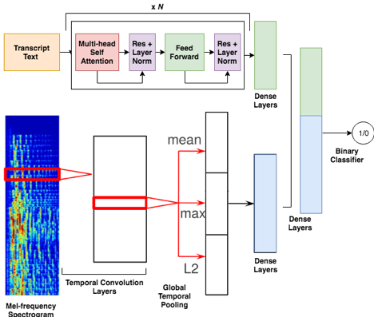

# Context Aware Deep Learning for Multi Modal Depression Detection

"Context Aware Deep Learning for multi modal depression detection", by Genevieve Lam, Huang Dongyan, and Weisi Lin.
Presented as an Oral at International Conference on Acoustics, Speech and Signal Processing 2019, United Kingdom.

We develop a multi-modal deep learning approach to detect depression from clinical interviews, trained on the Distress Analysis Interview Corpus. 

**Models:** We propose a novel method that incorporates: (1) pre-trained Transformer combined with data augmentation based on topic modelling for textual data; and (2) deep 1D convolutional neural network (CNN) for acoustic feature modeling.

**Results:** Our deep 1D CNN and Transformer models achieved state-of-the-art performance for audio and text modalities respectively. Combining them in a multi-modal framework also outperforms state-of-the-art for the combined setting.
Our strong experimental performance points to the promise of combining context-aware and data-driven methods for the automatic detection of depression.
Future work will focus on better multi-modal fusion for features from audio and text modalities, and on jointly training deep neural networks for multiple modalities. 



**Links:**
- PDF: [paper.pdf](paper.pdf)
- DOI: [10.1109/ICASSP.2019.8683027](https://ieeexplore.ieee.org/document/8683027)

## Data

#### Download DAIC-WOZ dataset

The data needs to gain access at [DAIC-WOZ database](http://dcapswoz.ict.usc.edu/) and download the zip files to your project directory by running the following command in your shell:

```shell
wget -r -np -nH --cut-dirs=3 -R index.html --user=daicwozuser --ask-password  http://dcapswoz.ict.usc.edu/wwwdaicwoz/
```

It contains audio, video, and text of interviews with 189 subjects. In our model, we would only need the audio and text. 


#### Data extraction

Next from  [Data extraction](./src/data) run :
- `extract_from_zip.py`: Extract the audio and text files from the server

---

## Topic Modeling 

From [Topic model](./src/topic_model) run the files:
- `topic_trans.py`: Label each segments to the related topics 
- `create_data_aug.py`: Create augmentation for both the text and audio components  

---

## Audio Model 

#### Installation

Steps for creating new conda environment with python 2 and tensorflow
1. conda create -n py2 python=2.7 
2. source activate py2
3. conda install -y numpy scipy cython ipython mkl jupyter pandas matplotlib scikit-learn 
4. conda install -y jupyterlab -c conda-forge
5. pip install --ignore-installed --upgrade tensorflow=1.3.0-gpu  
6. pip install pydub=0.22.1 librosa=0.6.2 

#### Usage

Then in the [Audio CNN](./src/audio_model) folder run:
- `cnn_aug_hyp.py`: Train CNN model
- `cnn_featurizer_augm_run2_0.666666666667f1.h5`: The features of the cnn model

---

## Transformer Model 

#### Installation

Steps for creating new conda environment with python 3 and tensorflow
1. conda create -n py36 python=3.6
2. source activate py36
4. conda install -y numpy scipy cython ipython mkl jupyter pandas matplotlib scikit-learn
5. pip3 install finetune==0.4.1
5. python3 -m spacy download en
6. pip install --ignore-installed --upgrade tensorflow-gpu
7. conda install -y jupyterlab -c conda-forge

#### Usage
Then in the [Text Transformer](./src/finetune_transformer) folder run the file:
- `data_creation.ipynb`: Used to create data augmentation for the text
- `main.py`: Trains Transformer model (can either use py or ipynb)
- `training.ipynb`: Trains the transformer model 

#### Helpful Links
- Finetune github: https://github.com/IndicoDataSolutions/finetune
- Finetune documentation: https://finetune.indico.io/

---

## Feedforward Model

#### Installation

Use the same conda environment with python 2 and tensorflow as the Audio Model.

#### Usage

From [Feedforward](./src/feedforward) run:
- `reload_model.ipynb`: Reload the feedforward model
- `fd_augm_run200_f10.869565217391.h5`: The Feedforward model 
- `feedforward_aug.py`: Train feedforward model with CNN & Transformer features 

## Citation

```
@inproceedings{lam2019context,
  title={Context-aware deep learning for multi-modal depression detection},
  author={Lam, Genevieve and Dongyan, Huang and Lin, Weisi},
  booktitle={ICASSP 2019-2019 IEEE international conference on acoustics, speech and signal processing (ICASSP)},
  pages={3946--3950},
  year={2019},
  organization={IEEE}
}
```